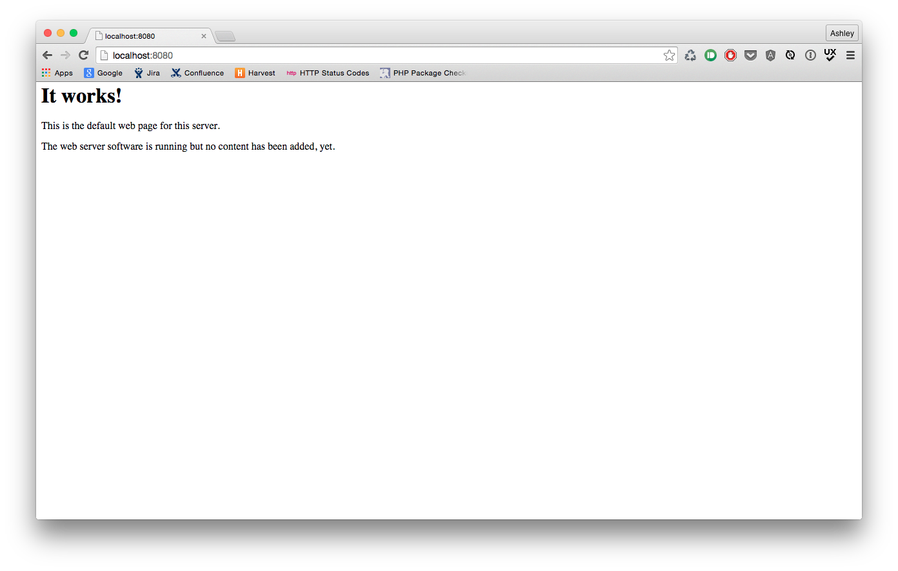

In this post we will get docker running in a [coreos](https://coreos.com) vm using [vagrant](https://www.vagrantup.com), then setup the ability to port forward from your docker vm into your local machine.

###Why?

If you're running ubunutu or similar on your computer then setting up docker is nice and easy, however for those of us on Mac OS X or Windows, things are not quite so smooth.
In order to set up docker we have to use a tool called [boot2docker](http://boot2docker.io), I have used this tool but with limited success so my prefered way is to use coreos with vagrant so I will show you how to set that up.

###Vagrant

If you havent already got vagrant set up you will need to first install [Virtual Box](https://www.virtualbox.org/wiki/Downloads), just download it and run the installer; nice and simple.

Now you can go and download [Vagrant](https://www.vagrantup.com/downloads.html) which again you just download and run the installer, in my experiences everything just works.

####The Vagrantfile

You will want to create a working directory for all the following steps.

Now you need to create a file called "Vagrantfile" you can create this manually, or by running a command called `vagrant init` from within your working directory.

`vagrant init` will add more boilerplate than we need, so you may end up deleting most of it anyway.

Now lets edit this Vagrantfile, you should have something like this to start with.

	VAGRANTFILE_API_VERSION = "2"
	Vagrant.configure(VAGRANTFILE_API_VERSION) do |config|
		# config goes here
	end
    
We now need to add some configuration within the config block. The following snippets should go within the config block (where it says "config goes here").

First we need to tell vagrant to use a coreos image for the vm.

	config.vm.box = "coreos"
	config.vm.box_url = "http://storage.core-os.net/coreos/amd64-generic/dev-channel/coreos_production_vagrant.box"

    
Now we need to configure the port forwarding, which is one of the most important steps.

	config.vm.network :forwarded_port, guest: 80, host: 8080
    
This forwards port 80 from the coreos vm to port 8080 on your local machine. If you want to run multiple dockers on this coreos vm then you may want to forward a few ports. You can even loop through several ports like so:

	for i in 8000..8100
        config.vm.network :forwarded_port, guest: i, host: i
    end
    
This will give you 101 ports forwarded. Note that the ports will be the same on the coreos vm as on your local machine.    

Here is my final vagrant file, there are a few other sections in here that I didnt cover fully such as the private network and folder sharing/syncing.

	# Vagrantfile API/syntax version. Don't touch unless you know what you're doing!
	VAGRANTFILE_API_VERSION = "2"

	Vagrant.configure(VAGRANTFILE_API_VERSION) do |config|
  		config.vm.box = "coreos"
  		config.vm.box_url = "http://storage.core-os.net/coreos/amd64-generic/dev-channel/coreos_production_vagrant.box"
  		# The 10.* IP range is private
  		config.vm.network "private_network", ip: "10.1.2.3"
  		config.vm.network :forwarded_port, guest: 80, host: 8080

  		# This will require sudo access when using "vagrant up"
  		config.vm.synced_folder ".", "/home/core/share",
      		id: "core",
      		:nfs => true,
      		:mount_options => ['nolock,vers=3,udp']

  		# plugin conflict
  		if Vagrant.has_plugin?("vagrant-vbguest") then
      		config.vbguest.auto_update = false
  		end
	end
    
    
Now run `vagrant up` and we will have our coreos box running within a few moments.

###Docker

To install docker on CoreOS you have to.... do nothing, docker is pre-installed on CoreOS which makes our lives easier, isn't that nice :)

When running your docker image, now all you need to do is forward what runs on port 80 to port 80 on the coreos vm.

e.g.

	docker run -d -p 80:80 your-image
    
The syntax for port frowarding is `from:to` so this is forwarding from port 80 on the docker box, if you forwarded multiple ports in your vagrantfile you may need to change the ports e.g. `docker run -d -p 80:8080 your-image`
    
This assumes you have an image called `your-image` that exposes port 80. 

Now when you go to your browser and vist [localhost:8080](http://localhost:8080) this will actually map to whats running in coreos on port 80 which actually maps to what is running in your docker on port 80.

###Result:

